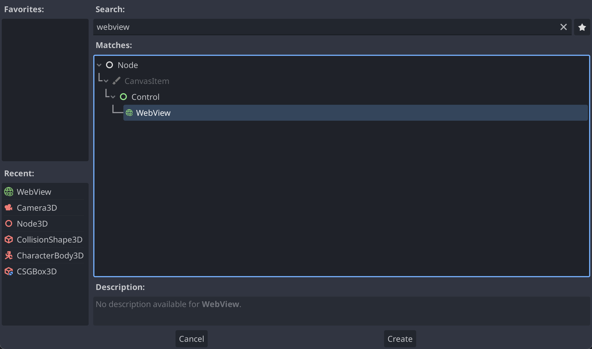

<h1 align="center">WebView Rendering Library for Godot</h1>

<p align="center">
  <a href="https://github.com/tauri-apps/wry">WRY</a> is a cross-platform webview rendering library. This extension allows you to use the native webview in Godot to build browsers and GUIs with HTML, CSS and JavaScript.
</p>


## 📥 Download

You can download the extension directly on the [Godot Asset Library](https://godotengine.org/asset-library/asset/3426) or by navigating to the "AssetLib" tab in the editor and searching for "wry".

Alternatively, you can go to the [Releases](https://github.com/doceazedo/godot_wry/releases) page, download the latest ZIP (_not_ the source code) and import it manually into your project.

## ⚙️ Supported platforms

| Platform    | Support      | Web engine                 |
| ----------- | ------------ | -------------------------- |
| **Windows** | ✅ Supported | WebView2 (Chromium)        |
| **Mac**     | ✅ Supported | WebKit                     |
| **Linux**   | ✅ Supported | WebKitGTK                  |
| **Android** | 🚧 Planned   | Android WebView (Chromium) |
| **iOS**     | 🚧 Planned   | WebKit                     |

### Windows

⁠Windows 7, 8 and 8.1 are not supported since February 2024 with Rust 1.76, even tho WRY still supports them.

On Windows 10 (Version 1803 and later) and Windows 11, the [WebView2 runtime](https://developer.microsoft.com/microsoft-edge/webview2) is distributed as part of the operating system.

### Linux

WRY depends on [WebKitGTK](https://webkitgtk.org) to be installed to work on Linux.

### Android/iOS

WRY already offers upstream [mobile support](https://github.com/tauri-apps/wry/blob/dev/MOBILE.md). Contributions for implementing support for Android and iOS in this extension are very welcome.

## 🧰 Getting started

After installing the extension, you will now be able to see the **WebView** node inside `Node → CanvasItem → Control` when creating a new node. You can edit it's properties and layout as you wish.

|                        |                       |
| ----------------------------------------------------- | ---------------------------------------------- |
| <p align="center"><i>"Create new node" window</i></p> | <p align="center"><i>WebView inspector</i></p> |

## 🔄 Interop between WebView and Godot

Godot and the WebView can exchange messages with each other. This is useful for updating the UI data, or triggering game actions when interacting with the UI.

> 💡 **Example:** you can send a `play` message on a HTML button click, then Godot can listen for that message and start the game.

Sending messages from Godot to the WebView:

```py
$WebView.post_message("Hello from Godot!")
```

Sending messages from JavaScript to Godot:

```js
window.ipc.postMessage("Hello from JavaScript!");
```

Receiving messages in Godot using the `ipc_message` signal:

```py
func _on_web_view_ipc_message(message):
	print("Just got a message from the webview: %s" % message)
```

Receiving messages in JavaScript using an event listener:

```js
document.addEventListener("message", (event) => {
  console.log("Just got a message from Godot:");
  console.log(event.detail);
});
```

## 🚧 Caveats

Since WRY utilizes the system's native webview for HTML rendering, the results may vary across different platforms, similar to how a website might appear or behave differently in Chrome versus Safari.

It's important to note that WRY renders the webview directly within the window. This prevents rendering on 3D meshes and customizing the rendering process.

If these limitations are significant for your use case, consider alternatives like [gdcef](https://github.com/Lecrapouille/gdcef) or [godot-webview](https://godotwebview.com/).

Godot WRY does _not_ perform dependency checks. As of right now, game developers are responsible for ensuring all dependencies are present and handling missing libraries.

## 📝 TO-DO

> [!WARNING]  
> This extension is in active development, broken stuff is expected and contributions are appreciated!

These features should soon be completed before the 1.0.0 release:

- Load URLs from Godot project files via `res://`
- React to property changes (such as changing the URL, size and visibility)
- Implement JS evaluation
- Fix transparency when `full_window_size` is enabled

## 📚 License

The Godot WRY extension is licensed under MIT. WRY is licensed under Apache-2.0/MIT.
